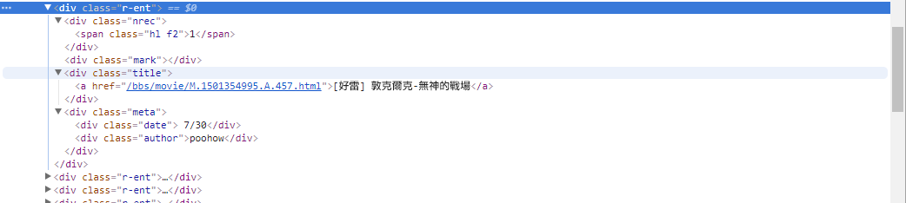
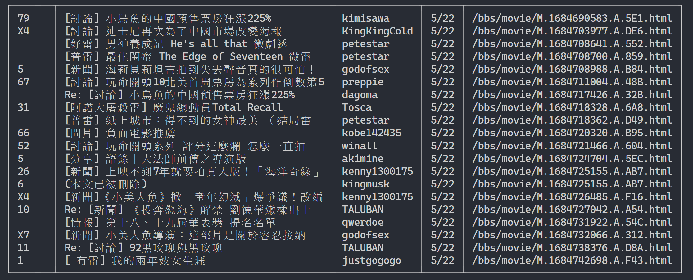
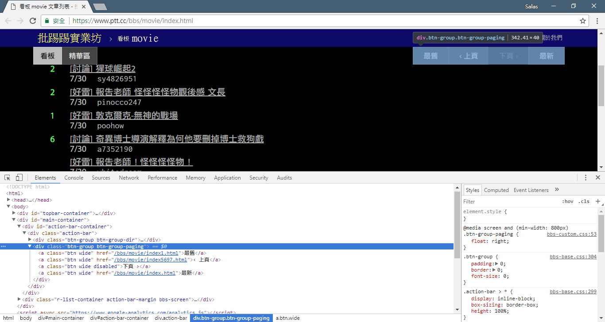
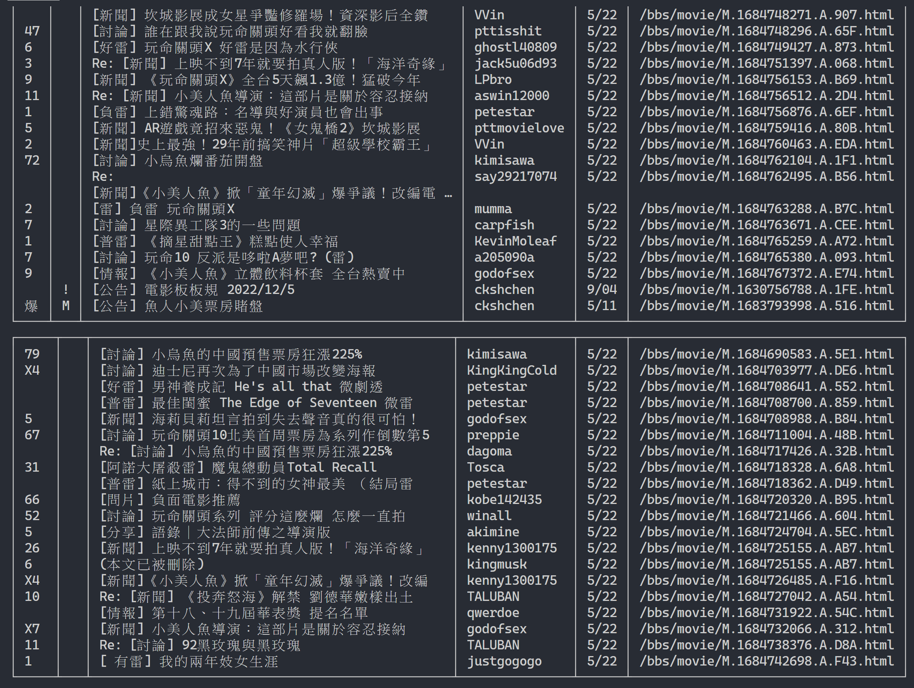
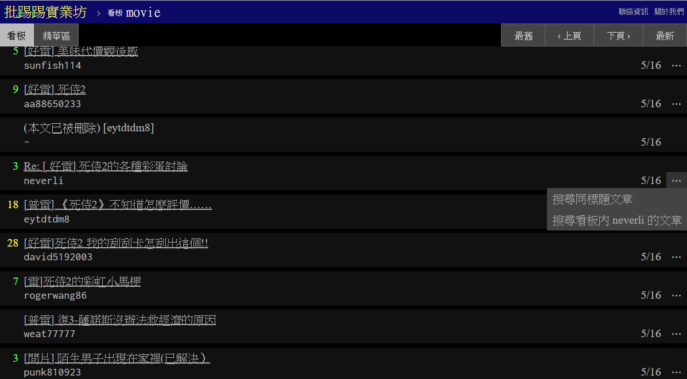
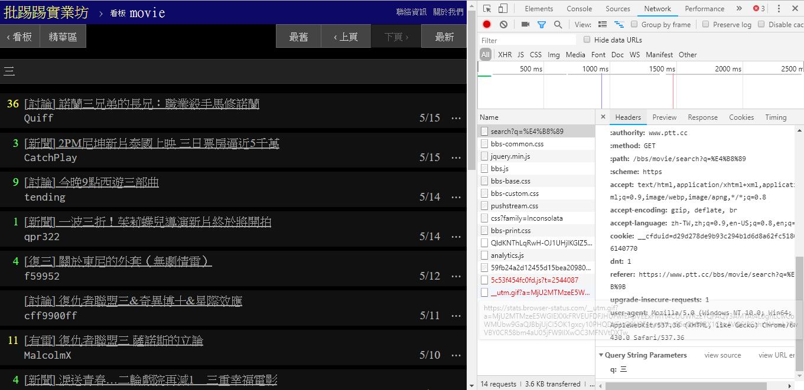
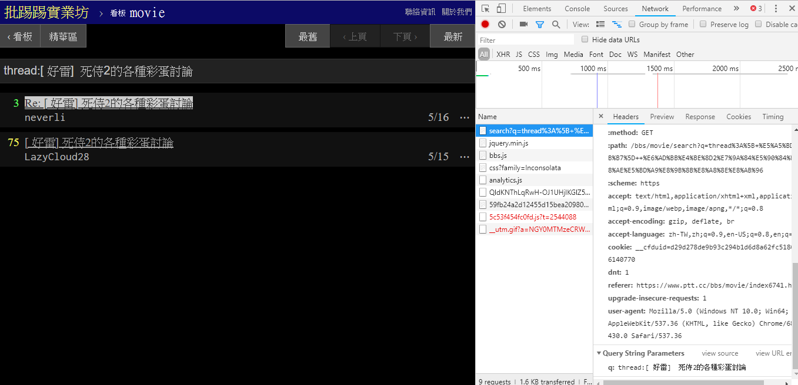
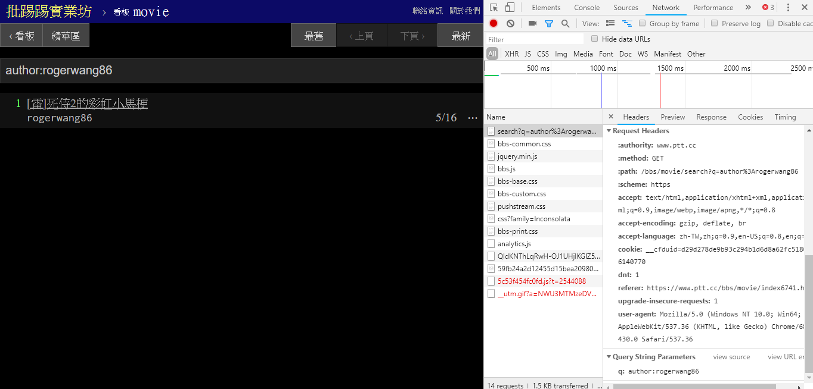
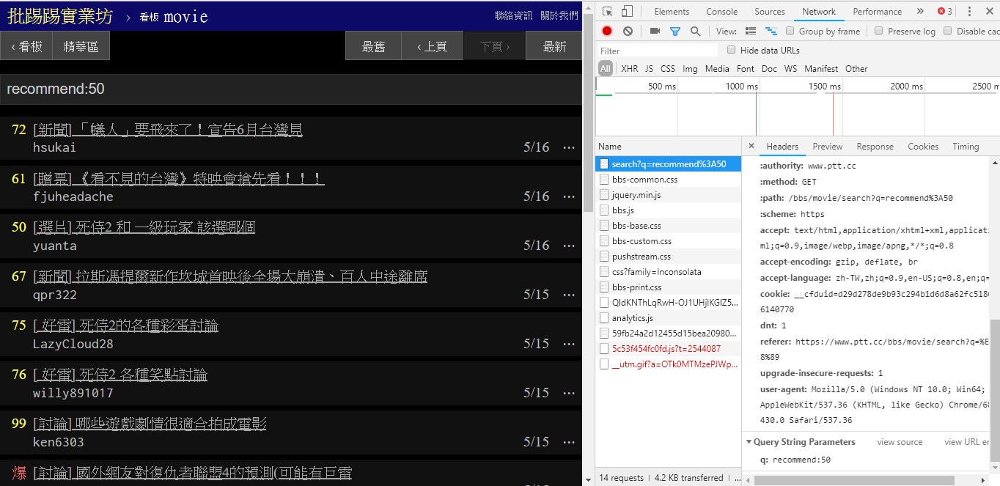
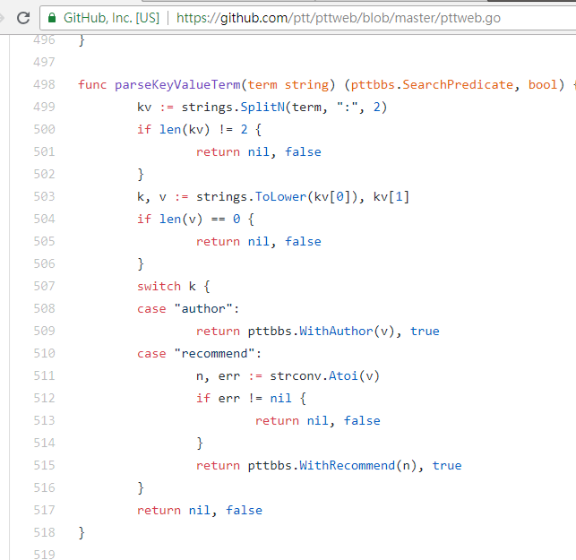

# 爬蟲教學 CrawlerTutorial

- [爬蟲教學 CrawlerTutorial](#爬蟲教學-crawlertutorial)
  - [什麼是網頁爬蟲？](#什麼是網頁爬蟲)
  - [實例教學 - PTT 批踢踢](#實例教學---ptt-批踢踢)
    - [環境安裝](#環境安裝)
    - [基礎篇](#基礎篇)
      - [第一步：所見即所抓，但都是純文字](#第一步所見即所抓但都是純文字)
      - [第二步：像瀏覽器一樣解析獲取的文字](#第二步像瀏覽器一樣解析獲取的文字)
      - [第三步：讓我們來看看這些標題訊息吧](#第三步讓我們來看看這些標題訊息吧)
      - [第四步：現在資料分析時代](#第四步現在資料分析時代)
      - [第五步：加油好嗎，能不能爬快點](#第五步加油好嗎能不能爬快點)
    - [進階篇 - PTT 搜尋功能](#進階篇---ptt-搜尋功能)
    - [撰寫自己的 API - 把 PTT 全包了](#撰寫自己的-api---把-ptt-全包了)
  - [相關專案](#相關專案)

## 什麼是網頁爬蟲？

當我們在網路上瀏覽時，常常會看到各式各樣感興趣的內容，例如新聞、商品、影片、圖片等等。但若是想從這些網頁中蒐集大量特定的資訊，手動操作就顯得費時費力。

這時，網頁爬蟲（Web Crawler）就派上用場了！簡單來說，網頁爬蟲就是可以模仿人類瀏覽器行為，自動抓取網頁資訊的程式。利用這種程式的自動化能力，我們可以輕鬆地從網站上「爬取」我們感興趣的資料，再把這些資料儲存下來以供日後分析使用。

網頁爬蟲的運作方式通常是先向目標網站發送 HTTP 請求，接著取得該網站回應的 HTML 並解析頁面中的內容，再將有用的資料取出來。例如，我們想要收集 PTT 八卦版上的文章標題、作者、時間等資訊，就可以使用網頁爬蟲的技術，自動化抓取這些資訊並儲存下來。這樣一來就可以不用手動瀏覽網站，就能取得所需的資訊。

網頁爬蟲有很多實際的應用，例如：

- 從網站中抓取新聞文章、商品評論或餐廳評分等。
- 從社交媒體上收集特定話題的資訊。
- 追蹤產品的價格變化。

當然，在使用網頁爬蟲時，我們需要遵守網站的使用條款及隱私政策，不可以違反網站的規定進行資訊抓取。同時，為了保障網站的正常運作，我們也需要設計適當的爬取策略，避免對網站造成過大的負荷。

## 實例教學 - PTT 批踢踢

### 環境安裝

本教學範例使用 Python3 並且會使用 pip 來安裝所需的套件。以下是需要安裝的套件：

- `requests`：用於發送與接收 HTTP 請求及回應。
- `requests_html`：用於分析和抓取 HTML 中的元素。
- `rich`：讓資訊精美地輸出到 console，例如顯示美觀的表格。
- `lxml` 或 `PyQuery`：用於解析 HTML 中的元素。
  - PyQuery 簡單易用，且解析速度比 BeautifulSoup 更快！只要熟悉 CSS selector 語法，就可以輕鬆上手。
  - lxml 解析速度非常快，但需要先熟悉 xpath 語法，不過也不難學習。

使用以下指令來安裝這些套件：

```bash
pip install requests requests_html rich lxml PyQuery
```

### 基礎篇

在基礎篇中，會簡單介紹如何從 PTT 網頁上收集資料，例如文章標題、作者和時間等。

以下用 PTT 的看版文章作為我們的爬蟲目標囉！

#### 第一步：所見即所抓，但都是純文字

在進行網頁爬蟲時，我們使用 `requests.get()` 函式來模擬瀏覽器發送 HTTP GET 請求來「瀏覽」網頁。這個函式會返回一個 `requests.Response` 物件，其中包含了網頁的回應內容。然而，需要注意的是，這個內容是以純文字的原始碼形式呈現，沒有經過瀏覽器的渲染。我們可以透過 `response.text` 屬性來取得。

```python
import requests

# 發送 HTTP GET 請求並獲取網頁內容
url = 'https://www.ptt.cc/bbs/Gossiping/index.html'
response = requests.get(url)
print(response.text)
```


在後續使用中我們會需要用到 `requests_html` 來擴增 `requests` 除了能像瀏覽器一樣瀏覽，也需要解析 HTML 網頁，`requests_html` 會將純文字的 `response.text` 原始碼包進 `requests_html.HTML` 方便後面的使用。改寫也非常簡單使用 `session.get()` 來替代上述的 `requests.get()`。

```python
from requests_html import HTMLSession

# 建立 HTML 會話
session = HTMLSession()
# 發送 HTTP GET 請求並獲取網頁內容
response = session.get(url)
print(response.text)
```

然而，當我們嘗試套用這個方法到八卦版 (Gossiping) 時，可能會遇到錯誤。這是因為在第一次瀏覽八卦版時，網站會確認年齡是否已滿十八歲；當我們點擊確認後，瀏覽器會記錄相應的 cookies，使得下次再次進入時就不會再次詢問（你可以試著使用無痕模式打開測試看看八卦版首頁）。然而，對於網頁爬蟲來說，我們需要把該筆特殊的 cookies 記錄下來，這樣在瀏覽時就能假裝已通過十八歲的測試。

```python
import requests

url = 'https://www.ptt.cc/bbs/Gossiping/index.html'
session = HTMLSession()
session.cookies.set('over18', '1')  # 向網站回答滿 18 歲了 !

# 發送 HTTP GET 請求並獲取網頁內容
response = session.get(url)
print(response.text)
```

#### 第二步：像瀏覽器一樣解析獲取的文字

接下來，我們可以使用 `response.html.find()` 方法來進行元素的定位，並使用 CSS 選擇器來指定目標元素。在這個步驟中，我們可以觀察到在 PTT 網頁版中，每篇文章的標題訊息都位於具有 `r-ent` 類別的 `div` 標籤中。因此，我們可以使用 CSS 選擇器 `div.r-ent` 來定位這些元素。


使用 `response.html.find()` 方法會回傳一個符合條件的元素列表，所以我們可以使用 `for` 迴圈來逐個處理這些元素。在每個元素內部，我們可以使用 `element.find()` 方法來進一步解析元素，並使用 CSS 選擇器來指定要提取的資訊。在這個範例中，我們可以使用 CSS 選擇器 `div.title` 來定位標題元素。同樣地，我們可以使用 `element.text` 屬性來獲取元素的文字內容。

以下是使用 `requests_html` 的範例程式碼：

```python
from requests_html import HTMLSession

# 建立 HTML 會話
session = HTMLSession()
session.cookies.set('over18', '1')  # 向網站回答滿 18 歲了 !
# 發送 HTTP GET 請求並獲取網頁內容
response = session.get(url)

# 使用 CSS 選擇器定位目標元素
elements = response.html.find('div.r-ent')
for element in elements:
    # 提取資訊...
```

#### 第三步：讓我們來看看這些標題訊息吧

在前一步驟中，我們使用了 `response.html.find()` 方法來定位每個文章的元素。這些元素是以 `div.r-ent` 的 CSS 選擇器定位到的。
你可以使用開發者工具 (Developer Tools) 功能來觀察網頁的元素結構。打開網頁後按下 F12 鍵，將顯示一個開發者工具面板，其中包含了網頁的 HTML 結構和其他資訊。



使用開發者工具，你可以使用滑鼠指標在網頁上選擇特定的元素，然後在開發者工具面板中查看該元素的 HTML 結構、CSS 屬性等詳細資訊。這樣可以幫助你確定要定位的元素和相應的 CSS 選擇器。
另外，或許會發現怎麼程式有時候會出錯啊？！看看網頁版發現原來當該頁面中有文章被刪除時，網頁上的 `＜本文已被刪除＞` 這個元素的原始碼 `結構` 和原本不一樣哇！所以我們可以進一步強化來處理文章被刪除的情況。

現在，讓我們回到使用 `requests_html` 進行資訊提取的範例程式碼：

```python
import re

# 使用 CSS 選擇器定位目標元素
elements = response.html.find('div.r-ent')

# 逐個處理每個元素
for element in elements:
    # 可能會遇上文章已刪除的狀況，所以用例外處理 try-catch 包起來
    try:
        push = element.find('.nrec', first=True).text  # 推文數
        mark = element.find('.mark', first=True).text  # 標記
        title = element.find('.title', first=True).text  # 標題
        author = element.find('.meta > .author', first=True).text  # 作者
        date = element.find('.meta > .date', first=True).text  # 發文日期
        link = element.find('.title > a', first=True).attrs['href']  # 文章網址
    except AttributeError:
        # 處理已經刪除的文章資訊
        if '(本文已被刪除)' in title:
            # e.g., "(本文已被刪除) [haudai]"
            match_author = re.search('\[(\w*)\]', title)
            if match_author:
                author = match_author.group(1)
        elif re.search('已被\w*刪除', title):
            # e.g., "(已被cappa刪除) <edisonchu> op"
            match_author = re.search('\<(\w*)\>', title)
            if match_author:
                author = match_author.group(1)

    print('推文數:', push)
    print('標記:', mark)
    print('標題:', title)
    print('作者:', author)
    print('發文日期:', date)
    print('文章網址:', link)
    print('---')
```

*輸出文字處理：*

這邊我們可以利用 `rich` 顯示精美的輸出，首先建立起 `rich` 的表格物件，然後將上述範例程式碼迴圈中的 `print` 替換成 `add_row` 到表格。最後，我們使用 `rich` 的 `print` 函式才能正確將表格輸出到終端。

執行結果

```python
import rich
import rich.table

# 建立 `rich` 表格物件，設定不顯示表頭
table = rich.table.Table(show_header=False)

# 逐個處理每個元素
for element in elements:
    ...
    # 將每個結果新增到表格中
    table.add_row(push, title, date, author)

# 使用 rich 套件的 print 函式輸出表格
rich.print(table)
```



#### 第四步：現在資料分析時代

現在，我們將使用「觀察法」來找出上一頁的連結。不，我不是指問你瀏覽器上的按鈕在哪裡，而是要看開發者工具中的「source tree」。我相信你已經發現了，關於頁面跳轉的超連結位於 `<div class="action-bar">` 的 `<a class="btn wide">` 元素中。因此，我們可以像這樣提取它們：

```python
# 控制頁面選項: 最舊/上頁/下頁/最新
controls = response.html.find('.action-bar a.btn.wide')
```



而我們需要的是「上頁」的功能，為什麼呢？因為 PTT 是最新的文章顯示在前面啊～所以要挖資料必須往前翻。

那怎麼使用呢？先去抓出 `control` 中第二個(index 為 1)的 `href`，然後他可能長這樣 `/bbs/movie/index3237.html`；而完整的網址 (URL) 必須要有 `https://www.ptt.cc/` (domain url) 開頭，所以用 `urljoin()` (或是字串直接相接) 把 Movie 首頁連結和新的 link 比對合併成完整的 URL！

```python
import urllib.parse

def parse_next_link(controls):
    link = controls[1].attrs['href']
    next_page_url = urllib.parse.urljoin('https://www.ptt.cc/', link)
    return next_page_url
```

現在我們將函式重新整理一下方便後續說明，讓 [第三步：讓我們來看看這些標題訊息吧](#第三步讓我們來看看這些標題訊息吧) 中處理每個文章元素的範例變成獨立的函式 `parse_article_entries(elements)`

```python
# 解析該頁文章列表中的元素
def parse_article_entries(elements):
    results = []
    for element in elements:
        try:
            push = element.find('.nrec', first=True).text
            mark = element.find('.mark', first=True).text
            title = element.find('.title', first=True).text
            author = element.find('.meta > .author', first=True).text
            date = element.find('.meta > .date', first=True).text
            link = element.find('.title > a', first=True).attrs['href']
        except AttributeError:
            # 處理文章被刪除的情況
            if '(本文已被刪除)' in title:
                match_author = re.search('\[(\w*)\]', title)
                if match_author:
                    author = match_author.group(1)
            elif re.search('已被\w*刪除', title):
                match_author = re.search('\<(\w*)\>', title)
                if match_author:
                    author = match_author.group(1)
        # 將解析結果加到回傳的列表中
        results.append({'push': push, 'mark': mark, 'title': title,
                        'author': author, 'date': date, 'link': link})
    return results
```

接下來，我們就可以處理多頁內容

```python
# 起始首頁
url = 'https://www.ptt.cc/bbs/movie/index.html'
# 想要收集的頁數
num_page = 10

for page in range(num_page):
    # 發送 GET 請求並獲取網頁內容
    response = session.get(url)
    # 解析文章列表的元素
    results = parse_article_entries(elements=response.html.find('div.r-ent'))
    # 解析下一個連結
    next_page_url = parse_next_link(controls=response.html.find('.action-bar a.btn.wide'))

    # 建立表格物件
    table = rich.table.Table(show_header=False, width=120)
    for result in results:
        table.add_row(*list(result.values()))
    # 輸出表格
    rich.print(table)

    # 更新下面一位 URL~
    url = next_page_url
```

*輸出結果：*



#### 第五步：加油好嗎，能不能爬快點

取得文章列表資訊後，再來就是取得文章（PO 文）內容（post content）了！
在 metadata 中的 `link` 就是每篇文章的連結，同樣使用 `urllib.parse.urljoin` 串接出完整網址之後發出 HTTP GET 來取得該篇文章的內容。
我們可以觀察到去抓每篇文章內容的任務是高度重複性的，很適合使用平行化的方法來處理。

在 Python 中，可以使用 `multiprocessing.Pool` 來做 high-level 的 multiprocessing programming～這是 Python 中使用 multi-process 最簡便的方法！非常適合這種 SIMD (Single Instruction Multiple Data) 的應用場景。使用 `with` statement 語法讓使用完之後將 process 資源自動釋放。而 ProcessPool 的用法也很簡單，`pool.map(function, items)`，有點像 functional programming 的概念，將 function 套用在每一個 item 上，最後得出跟 items 一樣數量的結果列表。

使用在前面介紹的抓取文章內容的任務上：

```python
from multiprocessing import Pool

def get_posts(post_links):
    with Pool(processes=8) as pool:
        # 建立 processes pool 並指定 processes 數量為 8
        # pool 中的 processes 將用於同時發送多個 HTTP GET 請求，以獲取文章內容

        responses = pool.map(session.get, post_links)
        # 使用 pool.map() 方法在每個 process 上都使用 session.get()，並傳入文章連結列表 post_links 作為參數
        # 每個 process 將獨立地發送一個 HTTP GET 請求取得相應的文章內容

        return responses

response = session.get(url)
# 解析文章列表的元素
metadata = parse_article_entries(elements=response.html.find('div.r-ent'))
# 解析下一頁的連結
next_page_url = parse_next_link(controls=response.html.find('.action-bar a.btn.wide'))
# 一串文章的 URL
post_links = [urllib.parse.urljoin(url, meta['link']) for meta in metadata]

results = get_posts(post_links)  # list(requests_html.HTML)
rich.print(results)
```

```python
import time

if __name__ == '__main__':
    post_links = [...]
    ...
    start_time = time.time()
    results = get_posts(post_links)
    print(f'花費: {time.time() - start_time:.6f}秒，共 {len(results)} 篇文章')
```

附上實驗實測結果：

```bash
# with 1-process
花費: 15.686177秒，共 202 篇文章

# with 8-process
花費: 3.401658秒，共 202 篇文章
```

可以看出整體執行速度加速了將近五倍，但並不一定 `Process` 越多越好，除了必須看 CPU 等硬體規格，主要還是取決於網卡、網速等外部裝置的限制。

**上面的程式碼都可以在 (`src/basic_crawler.py`) 中可以找到！**

### 進階篇 - PTT 搜尋功能

**PTT Web 新功能：搜尋！** 終於可以在網頁版使用了

一樣使用 PTT 的電影版作為我們的爬蟲目標囉！在新版功能中可以搜尋的內容包含，

- 標題關鍵字 (title keywords)
- 相同標題文章 (thread title)
- 同作者文章 (author)
- 推文數多的文章 (recommend)



前三者都可以從新版的頁面原始碼及送出請求發現規則，不過推文數搜尋似乎還沒有在網頁版 UI 介面中出現；所以這邊是筆者從 `PTT 網站原始碼` 中挖掘出來的參數。平常我們瀏覽的 PTT 其實包含 BBS server (就是 BBS)，以及前台的 Web server (網頁版)，而前台的 Web server 是用 Go 語言 (Golang) 寫的，可以直接存取後端 BBS 資料，並且以一般網站互動模式將內容渲染成網頁形式供瀏覽。


那其實要使用這些新功能非常簡單，只需要透過 `HTTP` `GET` 形式的 request 並且加上標準的 query string 方式就能獲得這些資訊。提供搜尋功能的 `endpoint` URL 為 `/bbs/{看板名稱}/search`，只要用對應的 query 即可從這邊獲得搜尋結果。首先以標題關鍵字為例，



從圖片中右下角可以看出，在搜尋時其實是對 `endpoint` 送出 `q=三` 的 `GET` 請求，所以整個完整的 URL 應該像是 `https://www.ptt.cc/bbs/movie/search?q=三`，不過從網址列複製下來的網址可能會是 `https://www.ptt.cc/bbs/movie/search?q=%E4%B8%89` 這樣的形式，是因為中文被 HTML encode 過了但代表的是相同意思。而在 `requests` 中，想要增加額外的 query 參數不用自己手動建構字串形式，只要透過 `param=` 的 dict() 放到函式參數即可，就像是這樣：

```python
search_endpoint_url = 'https://www.ptt.cc/bbs/movie/search'

resp = requests.get(search_endpoint_url, params={'q': '三'})
```



在搜尋相同文章 (thread) 時，可以由右下角資訊看出，其實就是將 `thread:` 這個字串串到標題前面後送出查詢。

```python
resp = requests.get(search_endpoint_url, params={'q': 'thread:[ 好雷]  死侍2的各種彩蛋討論'})
```



在搜尋相同作者文章 (author) 時，同樣由右下角資訊看出是將 `author:` 這個字串串上作者名字後送出查詢。

```python
resp = requests.get(search_endpoint_url, params={'q': 'author:rogerwang86'})
```



在搜尋推文數大於多少 (recommend) 的文章時，就是將 `recommend:` 這個字串串上希望搜尋到的最低推文數後送出查詢。另外可以從 PTT Web server 原始碼中發現推文數只能設定在 ±100 間。

```python
resp = requests.get(search_endpoint_url, params={'q': 'recommend:50'})
```

- PTT Web parsing 這些參數的 function 原始碼

    


另外值得一提的是，搜尋結果最後的呈現也跟基礎篇裡提到的一般版面相同，所以可以直接將前面的 function 再拿來重複利用，`Don't do it again!`

```python
resp = requests.get(search_endpoint_url, params={'q': 'recommend:50'})

post_entries = parse_article_entries(resp.text)  # [沿用]
metadata = [parse_article_meta(entry) for entry in post_entries]  # [沿用]
```

在搜尋中有另一個參數，頁數 `page` 就跟 Google 搜尋一樣，搜尋到的東西也許有很多頁，那麼就可以透過這個額外的參數來控制要取得第幾頁結果，而不需要再去 parse 頁面上的 link。

```python
resp = requests.get(search_endpoint_url, params={'q': 'recommend:50', 'page': 2})
```

### 撰寫自己的 API - 把 PTT 全包了

將前面所有的功能通通整合進 [ptt-parser](ptt-parser)，可以提供 command-line 功能以及可程式化呼叫的 API 形式的 `爬蟲`。

## 相關專案

- [dcard-spider](https://github.com/leVirve/dcard-spider): 透過 Dcard API 抓取/下載資料的高效能爬蟲。
- [ptt-spider](https://github.com/leVirve-arxiv/ptt-spider): PTT 高效能爬蟲，使用 lxml 快速解析並利用 asynio/coroutines 提高效率。
- [ptt-scrapy](https://github.com/leVirve-arxiv/ptt-scrapy): 使用 `scrapy` 穩定爬取 PTT 資料。
- [ptt-viewer](https://github.com/leVirve-arxiv/ptt-viewer): 將取得的資訊透過 Web UI 介面視覺化顯示。

<a rel="license" href="http://creativecommons.org/licenses/by/4.0/"></a><br />本著作由<a xmlns:cc="http://creativecommons.org/ns#" href="https://github.com/leVirve" property="cc:attributionName" rel="cc:attributionURL">leVirve</a>製作，以<a rel="license" href="http://creativecommons.org/licenses/by/4.0/">創用CC 姓名標示 4.0 國際 授權條款</a>釋出。
